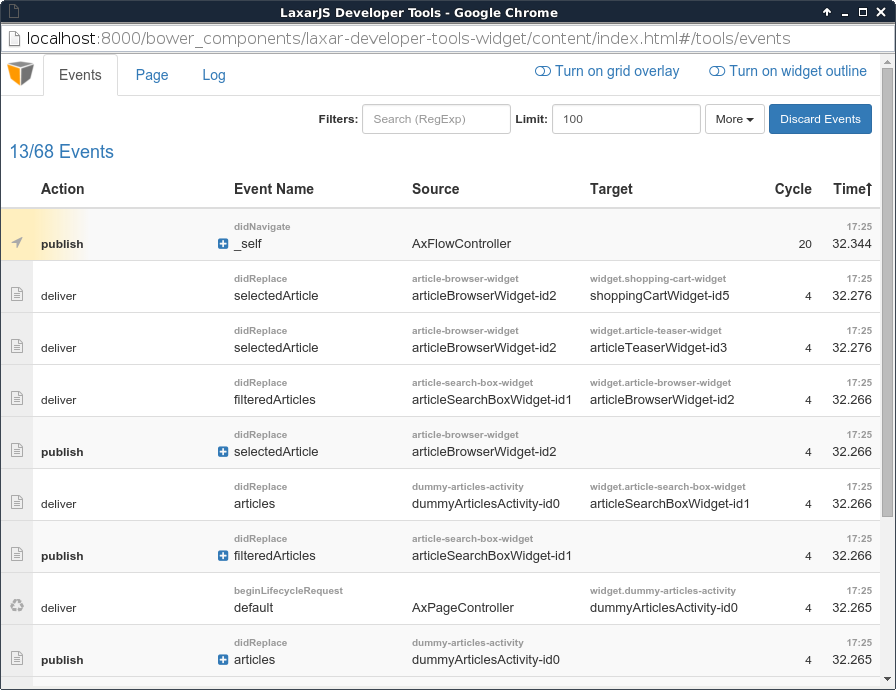
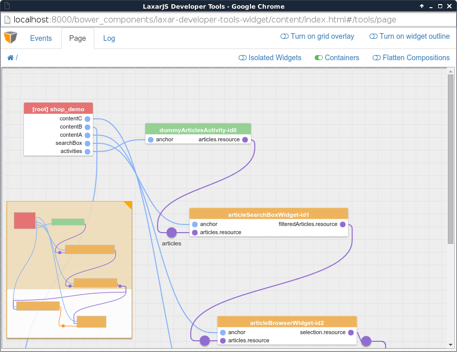

# ax-developer-tools-widget [](https://travis-ci.org/LaxarJS/ax-developer-tools-widget)

The ax-developer-tools-widget allows to open a _developer tools window_ that displays application events, helps visualizing the structure of the current page, and allows to browse log messages of the running LaxarJS application.


## Content
* [Appearance](#appearance)
* [Usage](#usage)
* [Features](#features)
* [Integration](#integration)
* [References](#references)


## Appearance

### Events tab



The events tab displays the latest publish/subscribe events of the currently running application, including subscribe/unsubscribe calls, as well as publication and delivery of events.
Events may be filtered by name, pattern, or source/target.

### Page tab



This "fusebox" view of the running application visualizes which widgets are connected through shared topics.
See [below](#usage) for more information on how to enable page inspection.

### Log tab

The log tab lists log messages that were created using the `laxar.log` API.
You can also use the browser console to inspect these messages without opening the developer tools.


## Usage

### Installation

For this version of the laxar-developer-tools-widget, make sure that your host application is using LaxarJS v1.2.0 or newer.
For installation instruction take a look at the [LaxarJS documentation](https://github.com/LaxarJS/laxar/blob/master/docs/manuals/installing_widgets.md).


### Configuration example

```json
{
   "widget": "laxarjs/ax-developer-tools-widget"
}
```

Use this configuration on a page to have a button that will open the developer tools window.
The window will also open when the global method `window.laxarShowDeveloperTools()` is called.

```json
{
   "widget": "laxarjs/ax-developer-tools-widget",
   "features": {
      "button": {
         "enabled": false
      },
      "open": {
         "onActions": [ "showDevTools" ],
         "onGlobalMethod": "goDevelop"
      }
   }
}
```

Use this configuration on a page to have a developer tools window without visual representation, that will open when the action `showDevTools` is requested.
Alternatively, the window can be opened by calling the method `window.goDevelop()` (for example, from a bookmark).
_Note:_ To open the developer window in this fashion, it might be necessary to add an exception to the browser's popup blocker.

For full configuration options refer to the [widget.json](widget.json).


### Enabling Page Inspection

In the page tab, area nesting (blue connections) will work out of the box.
The standard [LaxarJS patterns](//github.com/LaxarJS/laxar-patterns/blob/master/docs/index.md#families-of-laxarjs-patterns) *resource*, *action* and *flag* are also supported, but additional markup needs to be added to your *widget.json* files for visualization to work:

* Configurable topics must use `"format": "topic"` in their JSON schema (with the exception of flag-receivers, which should use `"format": "flag-topic"` to support negated flags). For validation, this is recommended anyway.

* Configurable topics must specify the new field `"axRole"`:

   - `"outlet"` must be used for topic publishers (resource masters, action triggers, flag providers),

   - `"inlet"` must be used for topic subscribers (resource slaves, action/flag handlers).

* If not evident from the configuration path, the field `"axPattern"` must be specified to indicate the standard pattern (one of `"resource", "action", "flag"`) associated with the field.

For example, a widget that is master for a configurable `user.resource` would use the following JSON schema snippet, with description fields omitted in favour of brevity:

```js
"features": {
   // ...
   "user": {
      "type": "object",
      "properties": {
         "resource": {
            "type": "string",
            "format": "topic",
            "axRole": "outlet"
         }
      }
   }
}
```

Alternatively, a widget/activty that subscribes to `order.onActions` would use this:

```js
"features": {
   // ...
   "order": {
      "type": "object",
      "properties": {
         "onActions": {
            "type": "array",
            "item": {
               "type": "string",
               "format": "topic",
               "axRole": "inlet"
            }
         }
      }
   }
}
```


Finally, a widget/activty that processes a flag `visibility.toggleOn` would use this:

```js
"features": {
   // ...
   "visibility": {
      "type": "object",
      "properties": {
         "toggleOn": {
            "type": "string",
            "format": "flag-topic",
            "axRole": "inlet",
            "axPattern": "flag"
         }
      }
   }
}
```

The page inspector simply ignores configuration values that cannot be unambiguously assigned to a specific pattern and role.

[Compositions](https://github.com/LaxarJS/laxar/blob/master/docs/manuals/writing_compositions.md) are supported as well, just make sure to add "`format`' and "`role`"


### Development

To _develop_ (and not just use) the ax-developer-tools-widget _itself,_ the content application must be prepared:

```sh
cd content
npm install
```

To have the debug-version run within the developer tools window so that you may quickly try out any changes, enable the `develop` feature:

```json
{
   "widget": "laxarjs/ax-developer-tools-widget",
   "features": {
      "develop": {
         "enabled": true
      }
   }
}
```


To build and _release a new version_, the release-version of the embedded application must be committed:

```sh
cd content
npm run-script optimize
git add var
git commit ...
```


### Features

### 1. Allow to Open a Developer Tools Window _(open)_

Because the developer tools should exist independently of the host application state and navigation, they are opened in a separate window.

*R1.1* The widget MUST allow to configure an action for opening the developer tools window.
_Note:_ To open the developer window in this fashion, it might be necessary for the user to add an exception to the browser's popup blocker.
Alternatively, a _button_ (see below) may be used.

*R1.2* The widget MUST allow to configure a global javascript method name that opens the window directly.
_Note:_ This method is intended to be invoked manually by developers, and not as an API.

*R1.3* The widget MUST establish a _communication channel_ to the contents of the developer tools window when open.

*R1.4* The widget MUST intercept _event bus activity_ from the host application and forward it to the communication channel, encoding each message as a JSON string.
_Note:_ The JSON encoding is necessary to avoid that objects and their prototypes are kept across the window boundary.
Such cross-references leads to slow and error-prone behavior, at least in MSIE11.

*R1.5* The widget MUST intercept LaxarJS _log messages_ from the host application and forward them to the communication channel, encoding each message as a JSON string _(see above)_.

*R1.6* The widget MUST provide _content_ that must not depend in any way on the contents of the host application, except for relying on the communication channel.
The widget MUST observe the communication channel from within the window and update its contents with no more than a second delay.
Refer to the [AxHostConnectorWidget](content/includes/widgets/developer-tools/ax-host-connector-widget/README.md) for details.


### 2. Provide Access through a Graphical Button _(button)_

*R2.1* The widget MUST allow to render a graphical button.
This should be the default behavior.

*R2.2* It must be possible to disable the button.

*R2.3* It must be possible to configure a different label for the button.


### 3. Display Events from the Host Application

*R3.1* The widget MUST allow to view events from the host application.
Refer to the [events-display-widget](content/includes/widgets/events-display-widget/README.md) for details.


### 4. Display Log Messages from the Host Application

*R4.1* The widget MUST allow to view log messages from the host application.
Refer to the [log-display-widget](content/includes/widgets/log-display-widget/README.md) for details.


### 5. Visualize Widget Positions within the Host Application

*R5.1* The widget MUST help to identify widgets and their grid-alignment within the host application.
Refer to the [AxDeveloperToolbarWidget](content/includes/widgets/developer-tools/ax-developer-toolbar-widget/README.md) for details.


### 6. No-Op Mode

The widget MUST support being disabled completely using an application-wide _enabled-flag_.

*R6.1* The enabled-flag must be read from the LaxarJS configuration path `widgets.laxar-developer-tools-widget.enabled`.
The default value for the enabled-flag is `true`.
If the enabled-flag value is `false`, the widget MUST NOT subscribe to _takeActionRequest_ events, even if configured for the _open_ feature.

*R6.2* If the enabled-flag value is `false`, the widget MUST NOT intercept any events.

*R6.3* If the enabled-flag value is `false`, the widget MUST NOT intercept any log messages.

*R6.4* If the enabled-flag value is `false`, a global method MUST NOT be added, even if configured for the _open_ feature.

*R6.5* If the enabled-flag value is `false`, a button MUST NOT be rendered, even if the _button_ feature has been enabled (see above).

*R6.6* If the enabled-flag value is `false`, the pattern tracker (see below) must always be disabled.


### 7. Visualize the Structure of the Current Page

The widget must allow to inspect _nesting relationship_ between widgets, as well as connections formed by _pattern topics_ (resource, actions, flags) that are configured for widgets  and compositions on the page.

*R7.1* The widget MUST allow to widgets, activities, layouts and compositions, insofar as the correct meta data has been added to their descriptors.
Refer to the embedded [page-inspector-widget](content/includes/widgets/page-inspector-widget/README.md) for details.


### 8. Visualize the Structure of the Current Page

*R8.1* The widget MUST allow to inspect widgets and activities of the current host application page.
Refer to the embedded [events-display-widget](content/includes/widgets/events-display-widget/README.md) for details.


## Integration

### Patterns

The widget supports the following event patterns as specified by the [LaxarJS Patterns] documentation.

#### Actions

* Action: open.onActions
* Role: Receiver
* Description: Opens the developer tools window


## References

The following resources are useful or necessary for the understanding of this document.
The links refer to the latest version of the documentation.
Refer to the [bower.json](bower.json) for the specific version that is normative for this document.

* [LaxarJS Concepts]
* [LaxarJS Patterns]

[LaxarJS Concepts]: https://github.com/LaxarJS/laxar/blob/master/docs/concepts.md "LaxarJS Concepts"
[LaxarJS Patterns]: https://github.com/LaxarJS/laxar_patterns/blob/master/docs/index.md "LaxarJS Patterns"
