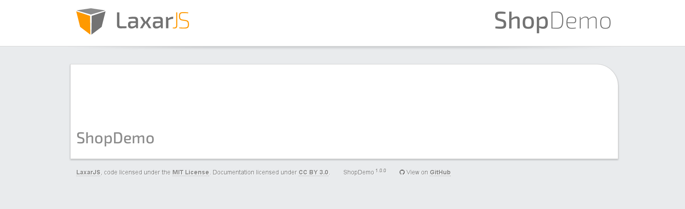

# Defining the Application Flow
After completing the initial two steps, we have a simple application with a first page, its layout and the first widget.
In this step we are going to make some modification in order to add a second page and to make for a nicer appearance of the application.

## The Pages and the Flow
We rename `application/pages/page1.json` to `application/pages/shop_demo.json` and `application/pages/page2.json` to `application/pages/finish_order.json`.
The `shop_demo` page allows the user to search for and browse through articles and submit an order.
The `finish_order` page will be shown after submitting an order to display an order confirmation message.

These changes then need to be applied to the *application flow* which is defined at [`application/flow/flow.json`](../../application/flow/flow.json).
The flow defines the available navigation *places* (available as URLs) and the corresponding pages.
It also defines the *entry point* of the application which is the place initially displayed to the user.
The concept of the flow, places and pages is elucidated [here](../missing_doc.md).

```json
{
   "places": {
      "entry": {
         "redirectTo": "shopDemo"
      },

      "shopDemo": {
         "page":  "shop_demo"
      },

      "finishOrder": {
         "page":  "finish_order"
      }
   }
}
```

Now we have a place for each of our two pages and an entry point which refers to the `shopDemo` place.

## Theme and Layout
At the moment our layout only has one column.
The final version of our [ShopDemo](http://laxarjs.github.io/shop_demo/#/shopDemo) has a header, three columns and a footer.
The header has a logo, a SearchBoxWidget and the HeadlineWidget we already created.
The main content has an ArticleBrowserWidget, an ArticleTeaserWidget and a ShoppingCartWidget.

We delete the files in the folder `application/layouts` and fetch the files from the completed ShopDemo:
[Layout](../../application/layouts/)

We change the pages to use the new [layout](../../application/layouts/application/default.theme/application.html):


**application/pages/shop_demo.json**
```json
"layout": "application"
```

**application/pages/finish_order.json**
```json
"layout": "application"
```

For further information about theme and layout there is a additional [document](../missing_doc.md).

After restarting the development server, the application should look similar to this:



## The Next Step
The next step is to create the [ArticleSearchBoxWidget](04_article_search_box_widget.md).


[<< Hello World](02_hello_world.md) | ShopDemo | [ArticleSearchBoxWidget >>](04_article_search_box_widget.md)
