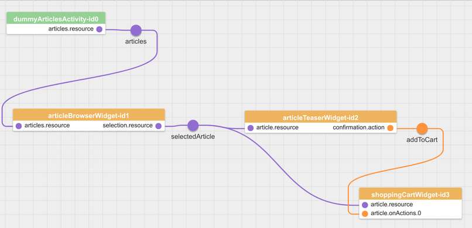

# The ArticleBrowserWidget

In this step we are going to implement the _ArticleBrowserWidget_ which displays a list of articles to the user and allows to select an individual article.
Another widget (to be implemented in the next step) will show details on the currently selected article.
This part of the tutorial will allow you to learn how widgets safely share resources through the event bus, and how resources can be displayed to the user.


## Creating the ArticleBrowserWidget

This is what the final ArticleBrowserWidget will look like:


It has a heading and a table containing the list of articles.
In the image, the sixth row represents the selected article.


### The Features of the ArticleBrowserWidget

The widget configuration has two features: *display* (a list of articles) and *select* (an article).


#### Displaying a List of Articles

For the first feature [*display*](../../includes/widgets/shop_demo/article-browser-widget/widget.json#L20), we allow to configure the name of the resource containing the articles.
In this application, the widget will receive the articles through a `didReplace` event, with the name configured under the key `resource` from the ArticleSearchBoxWidget.
Because the widget would be useless without a list of articles to render, we define the `resource` property as `required` in the feature schema.
Using the format `topic` allows us to use the same set of allowed characters as for the `resource` feature of the ArticleSearchBoxWidget.

Because the resource topic is configurable on both participating widgets, we could change the way that we obtain or display our articles anytime by adding a new widget, without having to touch any of the existing widgets.
This _resource pattern_ is one of several collaboration patterns that are commonly used with LaxarJS, and is described in more detail in the [resource manual](https://github.com/LaxarJS/laxar_patterns/blob/master/docs/patterns/resources.md#resource-patterns) of the [LaxarJS Patterns](https://github.com/LaxarJS/laxar_patterns) documentation.

Note that properties prefixed with `html` allow the use of html tags in the widget configuration.
The `html` prefix is not mandatory but a convention to easily determine whether a string may contain html markup or not, a simple approach that helps to avoid injection vulnerabilities.

The implementation of the controller for the feature *display* is simple:
We can use the function `patterns.resource.handlerFor( $scope ).registerResourceFromFeature( 'display' )` from the LaxarJS Patterns library.
It automatically handles _didReplace-_ and _didUpdate_-events for the configured display-resource and keeps track of its current state.
In the ArticleBrowserWidget, the data can be found on the object `$scope.resources.display`.

We add `laxar` and `laxar_patterns` to the [define block](../../includes/widgets/shop_demo/article-browser-widget/article-browser-widget.js#L3) and add a handler for the resource to the [controller function](../../includes/widgets/shop_demo/article-browser-widget/article-browser-widget.js#L21):
```javascript
patterns.resources.handlerFor( $scope )
   .registerResourceFromFeature( 'display', { onUpdateReplace: checkArticles } );
```

We will configure the resource *display* for the widget when adding it to a page so that it subscribes to the relevant events.
To implement the desired appearance, we modify the [HTML template](../../includes/widgets/shop_demo/article-browser-widget/default.theme/article-browser-widget.html) to display articles contained in the resource, or a hint that there are no articles available (yet).

Basic widget style is implemented using a [CSS stylesheet](../../includes/widgets/shop_demo/article-browser-widget/default.theme/css/article-browser-widget.css).


### Allowing the User to Select an Article

Now we'll cover the second feature of the ArticleBrowserWidget, called *select*.
This feature requires the configuration of a resource name under which the selected article will be published on the event bus.
Add the property [`select`](../../includes/widgets/shop_demo/article-browser-widget/widget.json#L53) to the widget features:

```json
"select": {
   "type": "object",
   "description": "Select an article.",
   "required": [ "resource" ],
   "properties": {
      "resource": {
         "type": "string",
         "description": "Name of the data resource with the selected article.",
         "format": "topic"
      }
   }
}
```

The feature *select* has a required property `resource` of type string.
In our application the ArticleTeaserWidget and the ShoppingCartWidget (implemented in the next steps) will listen for events related to this resource.

In our [HTML template](../../includes/widgets/shop_demo/article-browser-widget/default.theme/article-browser-widget.html#L25) we use the directive `ngClick` to detect the selection of an article by the user:

```html
<td data-ng-click="selectArticle( article )">{{ article.details.id }}</td>
<td data-ng-click="selectArticle( article )">{{ article.details.name }}</td>
<td data-ng-click="selectArticle( article )" class="price">{{ article.details.price | currency : "€ " }}</td>
```

To give the user a visual feedback of the selected article we use `ngClass`:

```html
<tr class="selectable"
    data-ng-repeat="article in resources.display.entries track by article.id"
    data-ng-class="{selected: article.id == selectedArticle.id }" >
```

Now we implement the method [`$scope.selectArticle`](../../includes/widgets/shop_demo/article-browser-widget/article-browser-widget.js) which is invoked by `ngClick`.
It publishes the selected article on the event bus:

```javascript
$scope.selectArticle = function( article ) {
   $scope.selectedArticle = article;
   var resourceName = $scope.features.select.resource;
   $scope.eventBus.publish( 'didReplace.' + resourceName, {
         resource: resourceName,
         data: article
      }, {
         deliverToSender: false
      }
   );
};
```

The third parameter which we pass to the `publish` function is optional.
The option `deliverToSender: false` implies that the event bus does not deliver the event back to the ArticleBrowserWidget.


### Adding the ArticleSearchBoxWidget to our Application

We update the [shop_demo](../../application/pages/shop_demo.json#L39) page and add the ArticleBrowserWidget to the area `content1a`:

```json
{
  "widget": "shop_demo/article-browser-widget",
  "features": {
     "display": {
        "resource": "articles"
    },
     "select": {
        "resource": "selectedArticle"
     }
  }
}
```

Because of the page configuration, the ArticleBrowserWidget expects the article list under the resource `articles` and the ArticleSearchBoxWidget publishes the article list under the [same name](../../application/pages/shop_demo.json#L29):

```json
"searchBox": [
   {
      "widget": "shop_demo/article-search-box-widget",
      "features": {
         "resource": "articles",
         "database":{
            "pouchDb": {
               "dbId": "articles"
            }
         }
      }
   }
]
```


The ArticleSearchBoxWidget fetches a list of articles from a database, in our case a PouchDB, and lets the user filter them with an input field.
If the database does not exist or has no articles the widget creates it and pushes the articles.
This procedure is for demo propose only.
The widget publishes the result list as resource `articles` on the event bus and the ArticleBrowserWidget receives it.
The other resource `selected Article` is published by the ArticleBrowserWidget and will be used by a receiver which we will introduce in the next step.



We stop the server (`Ctrl-C`) and start it with `npm start` again.

The application should list 11 articles now and display a search box at the top of the site.


### Resetting the Selected Article

For now our ArticleBrowserWidget lets the user select an article from the list.
But in case the list is updated or replaced the widget doesn't check if the selected article is possibly missing in the list.
The widget needs to react to such a situation and reset the selection.
If the selected article is missing in the changed list the widget has to reset the selection internally and send the appropriate event for the `select` resource.

By implementing the function [`checkArticles`](../../includes/widgets/shop_demo/article-browser-widget/article-browser-widget.js#L40) we'll try to make these tests pass.
This functions uses the `laxar.object.path` function which returns the value of `$scope.resources.display.entries` if it exists or the alternative given as third parameter in case it doesn't exist.
So in our case we'll either receive an array of entries, something that is no array or an empty array.
The second case is caught by checking `entries.length`:

```javascript
var entries = ax.object.path( $scope.resources, 'display.entries', [] );
if( !entries.length ) {
   $scope.selectArticle( null );
   return;
}
```


## The Next Step

The next step is to implement the [ArticleTeaserWidget](06_article_teaser_widget.md) which displays the details of one article.

[« The ArticleSearchBoxWidget](04_article_search_box_widget.md) | The ArticleBrowserWidget | [The ArticleTeaserWidget »](06_article_teaser_widget.md)
