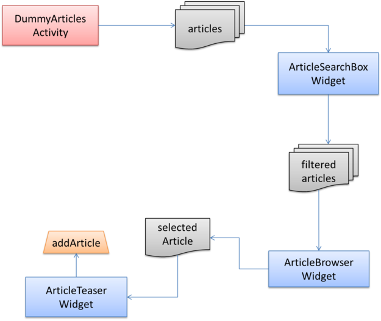
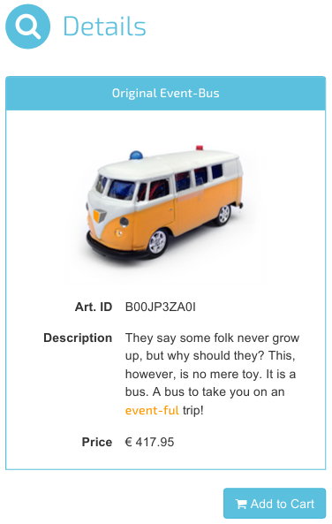

# The ArticleTeaserWidget

The _ArticleTeaserWidget_ that we will implement in this step is going to have two features:
It will display details on a given *article*, and it will allows the user to *confirm* adding that article to the shopping cart.
Having learned about the event bus and the *resource*-pattern already, this part of the tutorial will introduce the *action*-pattern and explain how widgets may respond to events asynchronously.

In the previous chapter we implemented the ArticleBrowserWidget which publishes its selected article as a resource on the event bus.
This is exactly the information that the ArticleTeaserWidget will use.
Whenever the user presses the _"add to cart"_ button, the widget publishes a `takeActionRequest` event for the ShoppingCartWidget (described in the next chapter) to add the selected article to the cart or to increase the amount if the article was already added.



As shown on the diagram, the ArticleTeaserWidget will get the selected article from the ArticleBrowserWidget.


## Appearance of the ArticleTeaserWidget

This is what the finished ArticleTeaserWidget will look like:



The widget has a headline, a picture of the article, a table containing details and the *add to cart* button.


## Displaying an Article

First, it must be possible to configure a resource representing the *article* to showcase.
In our ShopDemo application it will contain the article currently selected by the user.

The [implementation](../../includes/widgets/shop-demo/article-teaser-widget/article-teaser-widget.js#L17-20) of this feature does not differ much from the *articles* feature of the ArticleBrowserWidget:

```javascript
var articleResource = $scope.features.article.resource;
eventBus.subscribe( 'didReplace.' + articleResource, function( event ) {
   $scope.resources.article = event.data;
} );
```

For everything to work, we add the required configuration for the feature `article` to the [widget descriptor](../../includes/widgets/shop-demo/article-teaser-widget/widget.json#L16-26), adjust the [template](../../includes/widgets/shop-demo/article-teaser-widget/default.theme/article-teaser-widget.html) by adding the headline and a list for the article details, and again add some [styling](../../includes/widgets/shop-demo/article-teaser-widget/default.theme/css/article-teaser-widget.css).


## Let the User Add an Article to the Cart

The second requirement is that the user can *confirm* adding the selected article to the shopping cart.
For this we add a button that triggers a `takeActionRequest` event on the event bus to broadcast our intention.
Like the resource pattern, the [action pattern](https://github.com/LaxarJS/laxar-patterns/blob/master/docs/patterns/actions.md#action-patterns) is also described in the [LaxarJS Patterns documentation](https://github.com/LaxarJS/laxar-patterns/blob/master/docs/index.md#laxarjs-patterns).
The name of the action is configured under the [*confirmation*](../../includes/widgets/shop-demo/article-teaser-widget/widget.json#L28-38) feature.

To implement the feature *button* we add the method [`$scope.addToCart`](../../includes/widgets/shop-demo/article-teaser-widget/article-teaser-widget.js#L24-29) to the controller which causes a request for the configured action to be published:

```javascript
$scope.addToCart = function() {
   var actionName = $scope.features.button.action;
   $scope.eventBus.publish( 'takeActionRequest.' + actionName, {
      action: actionName
   } );
};
```

A simple button in the [HTML template](../../includes/widgets/shop-demo/article-teaser-widget/default.theme/article-teaser-widget.html#L38-41) triggers this method on click by using the `ngClick` directive from AngularJS:

```html
   <button class="btn btn-default btn-info pull-right"
           type="button"
           data-ng-class="{ 'ax-disabled': !resources.article }"
           data-ng-click="addToCart()"><i class="fa fa-shopping-cart"></i> Add to Cart</button>
```


## Adding the Widget to our Application

We add the widget to the area `contentB` of our [first page](../../application/pages/shop_demo.json#L43-55) and configure only the required features:

```json
"contentB": [
   {
      "widget": "shop-demo/article-teaser-widget",
      "features": {
         "article": {
            "resource": "selectedArticle"
         },
         "confirmation": {
            "action": "addArticle"
         }
      }
   }
]
"
```

As always after adding a new widget, we will need to restart the development server at this point.


## The Next Step

Our app shows details on the selected article now.
When pressing the *add to cart* button however, there is no visible reaction since the [ShoppingCartWidget](07_shopping_cart_widget.md) is still missing.
Let us implement that widget next.

[« The ArticleBrowserWidget](05_article_browser_widget.md) | The ArticleTeaserWidget | [The ShoppingCartWidget »](07_shopping_cart_widget.md)
