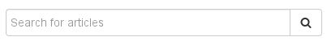

# The article-search-box-widget

We already have a working application with articles provided by the _dummy-articles-activity_, an _article-browser-widget_ to choose items from, an _article-teaser-widget_ for preview, and a _shopping-cart-widget_ to review and submit our order.
At this point, you might call it a day and skip right to the [final steps](08_final_steps.md).

However, there is one more feature you might want to implement:
Filtering the list of available articles using a text input.


To this end, this steps illustrates how to create an _article-search-box-widget_ which intercepts and filters the list of articles, _without touching any of the other widgets._ You will also learn how to access and modify URL parameters from your widget.


## Creating the article-search-box-widget

This is what the _article-search-box-widget_ will look like:



The widget contains a simple input field and a submit button, and allows the user to filter a list of articles.

As before create the widget with the generator, picking `"vue"` as the integration technology:

```console
yo laxarjs:widget article-search-box-widget
```


### Filtering a Resource

The _article-search-box-widget_ subscribes to a resource containing incoming *articles* and publishes a resource containing *filteredArticles* that match a user-specified search term.
Accordingly, we require the configuration of two resource topics in the [widget descriptor](../../application/widgets/article-search-box-widget/widget.json), using the _inlet_ role for the _articles_ resource, and the _outlet_ role for the _filteredArticles_ resource.
If no filter term has been entered by the user, the incoming articles are simply passed through in their entirety.

Let us start with the _template_ of the widget component, [article-search-box-widget.vue](../../application/widgets/article-search-box-widget/article-search-box-widget.vue):

```vue
<template>
<form role="form" @submit="filter()">
   <div class="form-group">
      <div class="input-group">
         <input class="form-control"
            type="text"
            placeholder="Search for articles"
            v-model="searchTerm">
         <span class="input-group-btn">
            <button class="btn btn-default" type="submit"><i class="fa fa-search"></i></button>
         </span>
      </div>
   </div>
</form>
</template>
```

This time, the `v-model` directive is used for bidirectional synchronization of the `searchTerm` property of the component data, and its DOM representation.
The actual filtering is triggered by the `@submit` event handler.
The widget controller looks like this:

```vue
<script>
export default {
   data: () => ({
      searchTerm: '',
      articles: [],
      filteredArticles: []
   }),
   created() {
      const { articles } = this.features;
      this.eventBus.subscribe( `didReplace.${articles.resource}`, event => {
         this.articles = event.data || [];
         this.filter();
      } );
   },
   methods: {
      filter() {
         const search = this.searchTerm.toLowerCase();
         const matches = subject => ( subject || '' ).toLowerCase().indexOf( search ) !== -1;
         const articles = search ?
            this.articles.filter( article =>
               [ 'some', 'id', 'htmlDescription' ].some( field => matches( article[ field ] ) )
            ) :
            this.articles;

         const hasChanged =
            this.filteredArticles.length !== articles.length ||
            this.filteredArticles.some( (article, i) => article.id !== articles[ i ].id );

         if( hasChanged ) {
            this.filteredArticles = articles;
            const { resource } = this.features.filteredArticles;
            this.eventBus.publish( `didReplace.${resource}`, {
               resource,
               data: articles
            } );
         }
      }
   }
};
</script>
```

Except for the `filter()` method, you will probably recognize this as being similar to the previous widgets.
The filtering procedure simply applies the (lowercased) search term to the current list of articles in order to generate the `filteredArticles`.
If these have changed since the last time the filter was run, they are published over the event bus.

The _article-search-box-widget_ can now filter articles according to a search term.
However, it would be nice if we could create links to individual search results and share or bookmark them.
For this, LaxarJS provides _place parameters_ that help to encode elements of the application state into the browser URL.


### Encoding State in a Place Parameter

To store parts of the application state in a _place parameter,_ you will need to extend the routing definition so that the parameter is encoded in the URL of your place.
To that end, modify the `"browse"` place in the [flow definition](../../application/flows/main.json) as follows:

```js
"browse": {
   "patterns": [ "/browse/:search", "/browse" ],
   // ...
}
```

By prepending `"/browse/:search"` to the place patterns, LaxarJS will now _decode_ the second URL path segment during routing, and include its value under `data.search` in the event payload of the `didNavigate` event.
LaxarJS will also process the `data.search` attribute when present in `navigateRequest` events leading to the `"browse"` place and _encode_ it into the URL.

To avoid a hard coupling between widget and flow definition, let us make the name of the parameter configurable.
Adding a new feature `"navigation"` with a configurable `"parameterName"` should do the trick.

```json
"navigation": {
   "type": "object",
   "required": [ "parameterName" ],
   "properties": {
      "parameterName": {
         "type": "string",
         "format": "topic",
         "axRole": "inlet",
         "description": "Place parameter to use for the search string."
      }
   }
}
```

In the _article-search-box-widget_, this allows you to reflect the `searchTerm` in the URL and to treat external changes (when the URL was modified by user or by another widget) just like changes to the input text.
All you need to do is modify the controller to subscribe to `didNavigate` events in order to read the search term, and to generate `navigateRequest` events when the user has modified the input field:

```vue
<template>
<form role="form" @submit="search()"><!-- ... --></form>
</template>

<script>
export default {
   data: () => ({
      searchTerm: '',
      articles: [],
      filteredArticles: []
   }),
   created() {
      const { articles, navigation } = this.features;
      this.eventBus.subscribe( `didReplace.${articles.resource}`, event => {
         this.articles = event.data || [];
         this.filter();
      } );
      this.eventBus.subscribe( 'didNavigate', event => {
         this.searchTerm = event.data[ navigation.parameterName ] || '';
         this.filter();
      } );
   },
   methods: {
      search() {
         const target = '_self';
         const data = {
            [ this.features.navigation.parameterName ]: this.searchTerm || null
         };
         this.eventBus.publish( `navigateRequest.${target}`, { target, data } );
      },
      filter() { /* ... */ }
   }
};
</script>
```

This version synchronizes the browser URL with the internal component model.
After integration of the widget (see below) try changing the URL in the browser to see it reflected in the search box, and vice versa.

Using place parameters in this manner allows you to safely compose multiple widgets that interact with the browser URL, without running into conflicts.
You can also let LaxarJS generate URLs for use in regular old _hyperlinks_ instead of manipulating the browser location through events, making your application more search-engine friendly.
For this, LaxarJS provides the [`axFlowService`](https://laxarjs.org/docs/laxar-v2-latest/api/runtime.flow_service/) injection.
The [laxar-vue-adapter documentation](https://laxarjs.org/docs/laxar-vue-adapter-v1-latest/) explains how to inject the `axFlowService` into a widget that uses the `"vue"` integration technology.


### Styling the Widget

As before, you may want to create an SCSS stylesheet to improve the appearance of the widget, while adding the appropriate CSS classes in the template.

  - [full widget descriptor](../../application/widgets/article-search-box-widget/widget.json), including `styleSource` attribute for SCSS support
  - [full .vue-component](../../application/widgets/article-search-box-widget/shopping-cart-widget.vue), with additional classes inserted
  - [full SCSS stylesheet](../../application/widgets/article-search-box-widget/default.theme/scss/article-search-box-widget.scss)

Now, all that is left is adding the widget to your page definition.


## Adding the Widget to the Page

To display the search box above the other widgets, let us add another widget area to the _three-colums_ layout:

```html
<div class="container">
   <div class="row">
      <div class="col col-md-12" data-ax-widget-area="searchBox"></div>
   </div>
   <div class="row">
      <div class="col col-md-4" data-ax-widget-area="contentA"></div>
      <div class="col col-md-4" data-ax-widget-area="contentB"></div>
      <div class="col col-md-4" data-ax-widget-area="contentC"></div>
   </div>
</div>
```

Let us now include the _article-search-box-widget_ into our [home](../../application/pages/home.json) page:

```json
"searchBox": [
   {
      "widget": "article-search-box-widget",
      "features": {
         "articles": {
            "resource": "articles"
         },
         "filteredArticles": {
            "resource": "filteredArticles"
         },
         "navigation": {
            "parameterName": "search"
         }
      }
   }
]
```

Finally, For the filtering to work, you just need to change the `articles.resource` of the _article-browser-widget_ to use the `"filteredArticles"` topic.


## The Next Step

[« Defining the Application Flow](06_application_flow.md) | The article-browser-widget | [Final Steps »](08_final_steps.md)
