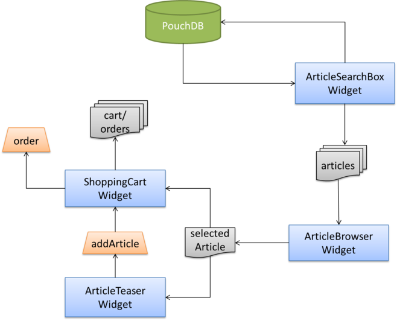
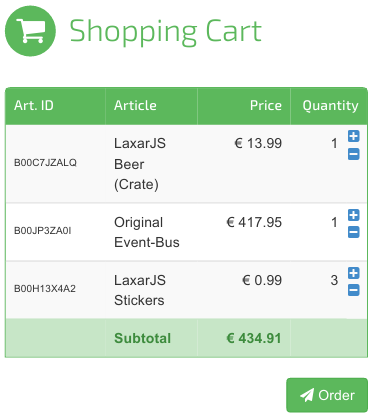

# The ShoppingCartWidget

The next step for our ShopDemo application is to implement the _ShoppingCartWidget_.
It will display the current shopping cart contents with all articles added by the user and allows the user change the order quantity for each article.
You will learn how widgets can use events to trigger flow-based navigation.



The ShoppingCartWidget receives the selected article and listens to the `addArticle` action event.
When the action is triggered, the widget adds the currently selected article to the cart.


## Appearance of the ShoppingCartWidget

This is what the finished ShoppingCartWidget will look like:



The ShoppingCartWidget displays a headline, a table of current contents and buttons to modify the quantity of each article as well as a button that allows to complete the process.


## Features of the ShoppingCartWidget

In detail the widget has two things to do:

* It has to subscribe to changes of the selected *article* resource and must listen to the action that expresses the user's intent to add the article to the cart.
  The user has to be able to change the quantity of individual articles, possibly causing positions to be removed from the shopping cart completely.

* To simulate the actual shopping process, the widget should also offer an *order* button.
  In a real shop, this would start the checkout/payment process.
  For our demo it is sufficient to simply navigate to a confirmation page.


### Displaying the Shopping Cart Articles

The widget has to display the shopping cart contents, for which it allows [configuration](../../includes/widgets/shop-demo/shopping-cart-widget/widget.json#L20-24) of an *article* resource.
If the shopping cart is empty, the widget simply displays an unobtrusive message instead.
This works very similar to the previous widgets.

The widget also allows to configure a [list of action topics](../../includes/widgets/shop-demo/shopping-cart-widget/widget.json#L25-32).
This is the glue that allows us to combine the article *selection resource* published by the ArticleBrowserWidget with the *confirmation action* requested by the ArticleTeaserWidget.
By convention, we allow multiple actions to be configured for all widgets that handle action requests so that it is always possible to form many-to-one relations.
In the controller, action handling is [implemented](../../includes/widgets/shop-demo/shopping-cart-widget/shopping-cart-widget.js#L24-32) using a _will/did_ pattern:

```javascript
$scope.features.article.onActions.forEach( function( action ) {
   eventBus.subscribe( 'takeActionRequest.' + action, function() {
      eventBus.publish( 'willTakeAction.' + action, { action: action } );
      if( $scope.resources.article !== null ) {
         addArticleToCart( $scope.resources.article );
      }
      eventBus.publish( 'didTakeAction.' + action, { action: action } );
   } );
} );
```

First, the widget subscribes to _takeActionRequest_ events for each configured action topic.
When receiving a request to take action, the widget first acknowledges the request by publishing a _willTakeAction_ event.
This signals that an action has begun and that a response will eventually follow, which can happen asynchronously.
However, in this case the widget is done right away after adding the article to its cart model, so that the _didTakeAction_ event is published right away.

Using this [will/did-pattern for actions](https://github.com/LaxarJS/laxar-patterns/blob/master/docs/patterns/actions.md#action-patterns), it is possible to track any action in progress.
This may be done by the requesting widget or by completely different widget that has been configured to "listen in", for example to show a progress indicator.


### Navigating to the Order Confirmation

In order to trigger navigation to a another page, the widgets allows to configure a _place_ for the [*order* feature](../../includes/widgets/shop-demo/shopping-cart-widget/widget.json#L36-45):

```json
"order": {
   "type": "object",
   "required": [ "target" ],
   "properties": {
      "target": {
         "type": "string",
         "description": "The target to be used in the navigateRequest event after placing the order."
      }
   }
}
```


## Adding the Widget to our Application

We add the widget to the `contentC` section of our [first page](../../application/pages/shop_demo.json#L77), where we connect it to the ArticleBrowserWidget and to the ArticleTeaserWidget, and configure the navigation target.

```json
"contentC": [
   {
      "widget": "shop-demo/shopping-cart-widget",
      "features": {
         "article": {
            "resource": "selectedArticle",
            "onActions": [ "addArticle" ]
         },
         "order": {
            "target": "finishOrder"
         }
      }
   }
]
```


## The Next Step

The user can now select an article, have a look at its details and add it to the cart.
But when trying to order, nothing happens because the second page is still missing!
Adding that page and configuring the control are the [final steps](08_final_steps.md) for completing our demo.

[« The ArticleTeaserWidget](06_article_teaser_widget.md)  | The ShoppingCartWidget | [Final steps »](08_final_steps.md)
