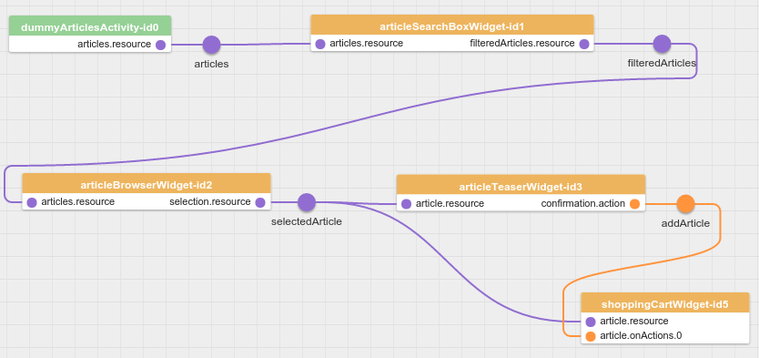

# ShoppingCartWidget
The next step for our ShopDemo application is to implement the ShoppingCartWidget.
It will display the cart with all added articles and let the user change the quantity of them.




The ShoppingCartWidget publishes the cart (list of orders) as a resource and triggers an action when the user demands an order.
It receives the selected article and listens to the `addArticle` action event.
If the action is triggered the widget adds the selected article to cart and publishes the updated cart.

## Appearance of the ShoppingCartWidget
This is what the final ShoppingCartWidget will look like:


The ShoppingCartWidget has a headline, a table with the cart and with buttons for increase or decrease the quantity of an article and a button for ordering the cart.

## Features of the ShoppingCartWidget
In detail the widget has three things to do.
First it has to subscribe to changes of the selected article and the `takeActionRequest` event, that expresses the intent of the user to add the article to the cart.
Next the widget has to manage the cart with the list of all added articles and has to display them.
The user has to be able to change the quantity and delete articles from the shopping cart completely.
Finally every change of the cart must be published as a resource on the EventBus to provide a current representation of the shopping cart contents to other widgets.
The responsibility of this widget is to manage the shopping cart content but not the process of ordering the items itself.
We will see that missing piece later in the last part of this tutorial.

For this we divide the tasks into three features *article*, *display* and *cart*.

### Feature  *display*
The widget has to display the shopping cart.
The necessary labels with their defaults are described in the [widget definition](../../includes/widgets/shop_demo/shopping_cart_widget/widget.json), but it's possible to configure own labels when adding the widget to the page.
If the shopping cart is empty the widget will display a hint with the html content configured under the path `features.display.htmlNoItemsText`.

### Feature *article*
This feature is the glue that consolidates the selection of an article in the ArticleBrowserWidget with the `takeActionRequest` event send as instruction to add the article to the cart.
Hence it's possible to configure the name of the resource resembling the article selection and one or more actions that trigger the addition of that article to the cart.

### Feature *cart*
This feature is used to configure the name of the resource resembling the the shopping cart.
Under this name the cart is published via a `didReplace` event.
Additionally the button which publishes a `takeActionRequest` to actually request the ordering of the articles is configured here.

### Implementation

The [features definition](../../includes/widgets/shop_demo/shopping_cart_widget/widget.json) of the ShoppingCartWidget is similar to the definition of the other widgets.

In the [controller](../../includes/widgets/shop_demo/shopping_cart_widget/shopping_cart_widget.js#L35) we add two handlers for the cart resource:

```javascript
var updatePublisherForCart = patterns.resources.updatePublisherForFeature( $scope, 'cart' );
var updateHandlerForCart = patterns.resources.updateHandler( $scope, 'cart' );
```

One for receiving updates

```javascript
$scope.eventBus.subscribe( 'didUpdate.cart', updateHandlerForCart );
```

and one to [publish updates](../../includes/widgets/shop_demo/shopping_cart_widget/shopping_cart_widget.js#L64):

```javascript
updatePublisherForCart.compareAndPublish( oldCart, resources.cart );
```

The object [`oldCart`](../../includes/widgets/shop_demo/shopping_cart_widget/shopping_cart_widget.js#L61) is a clone of the resource before it will change. For the creation we use the function [`deepClone`](https://github.com/LaxarJS/laxar/blob/master/docs/api/lib/utilities/object.md#deepclone-obj-) of LaxarJS.
```javascript
var oldCart = ax.object.deepClone( resources.cart );
```

The function `compareAndPublish` creates patches in [JSON Patch](http://tools.ietf.org/html/rfc6902) format and publishes them as `didUpdate` event on the EventBus.

For the initial publishing or to replace the resource we create the function [`replaceCart`](../../includes/widgets/shop_demo/shopping_cart_widget/shopping_cart_widget.js#L135).
It invokes the function `$scope.eventBus.publish`:

```javascript
function replaceCart() {
   $scope.eventBus.publish( 'didReplace.' + features.cart.resource, {
         resource: features.cart.resource,
         data: resources.cart
      }, {
         deliverToSender: false
      }
   );
}
```

When the widget receives a `takeActionRequest` event for one of the configured `features.article.onActions` actions it [invokes the function `addArticleToCart`](../../includes/widgets/shop_demo/shopping_cart_widget/shopping_cart_widget.js#L42):
```javascript
$scope.features.article.onActions.forEach( function( action ) {
   $scope.eventBus.subscribe( 'takeActionRequest.' + action, addArticleToCart );
} );
```

The function [`addArticleToCart`](../../includes/widgets/shop_demo/shopping_cart_widget/shopping_cart_widget.js#L99) publishes a `willTakeAction`,
```javascript
function addArticleToCart( event ) {
   $scope.eventBus.publish( 'willTakeAction.' + event.action, event );
```
adds the article to cart and publishes an update for the resource.

And finally publishes a [`didTakeAction`](../../includes/widgets/shop_demo/shopping_cart_widget/shopping_cart_widget.js#L119) event:
```javascript
$scope.eventBus.publish( 'didTakeAction.' + event.action, event );
```

The [HTML template](../../includes/widgets/shop_demo/shopping_cart_widget/default.theme/shopping_cart_widget.html) doesn't have LaxarJS specific code beyond the fact there are variables used which are defined in the [widget definition](../../includes/widgets/shop_demo/shopping_cart_widget/widget.json).


## Adding the Widget to our Application
We add the widget to the `content1c` section of our [first page](../../application/pages/shop_demo.json#L77).
We configure only the required features.


```json
"content1c": [
   {
      "widget": "shop_demo/shopping_cart_widget",
      "features": {
         "cart": {
            "resource": "cart",
            "order": {
               "action": "order",
               "button": {
                  "htmlLabel": "<i class='fa fa-send'></i> Order"
               }
            }
         },
         "article": {
            "resource": "selectedArticle",
            "onActions": [ "addArticle" ]
         }
      }
   }
],
```

## The Next Step
The user can select articles, can have a look at the details and can add them to cart.
But when he wants to order the cart nothing happens.
The ShoppingCartWidget triggers the action `order` but no other widget or activity reacts.
For this purpose we do some [final steps](08_final_steps.md) like implement the OrderActivity and add a second page.


[<< ArticleTeaserWidget](06_article_teaser_widget.md)  | ShoppingCartWidget | [Final steps >>](08_final_steps.md)
