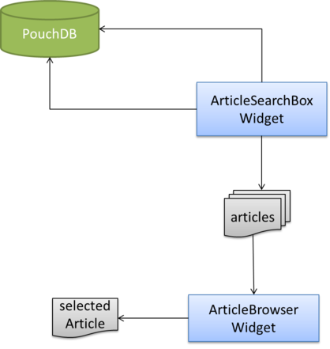
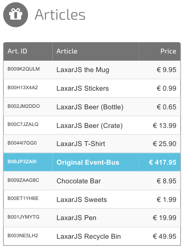

# ArticleBrowserWidget and ArticleSearchBoxWidget
At the moment the ShopDemo only displays a headline. It has no user interaction. To change this we extend the ArticleBrowserWidget to display a list of articles and allow to select one. The selected article will be shown by the ArticleTeaserWidget which we will implement in next chapter. The ArticleBrowserWidget gets the list with the articles from the ArticleSearchBoxWidget.

## Integration in the Application


## Appearance


## Features of the ArticleBrowserWidget
The widget has two features: **display** (a list of articles) and **select** (an article).  

### Display a List of Articles
The first feature **display** describes that the widget lists some articles. It will get the list from a resource via EventBus from another widget or an activity. First we write spec tests for this feature.

#### Write Spec Tests
If not still running, we start the server with "npm start" in the root directory of the app.
```
npm start
```

We open the spec test runner of the ArticleBrowserWidget:
[http://localhost:8000/includes/widgets/shop_demo/article_browser_widget/spec/spec_runner.html](http://localhost:8000/includes/widgets/shop_demo/article_browser_widget/spec/spec_runner.html)

We should see the Jasmine interface with one passing test "A ArticleBrowserWidget still needs some tests".

In preparation for the tests copy the first 50 Lines from the final ShopDemo to the spec js file:
[shop_demo/includes/widgets/shop_demo/article_browser_widget/spec/article_browser_widget_spec.js:](../../includes/widgets/shop_demo/article_browser_widget/spec/article_browser_widget_spec.js)

Change the object ```configuration``` (line 21):
``` javascript
var configuration = {
   display: {
      resource: 'articles'
   }
};
```

The first requirement to the widget is that it is possible to configure a data resource. We assume that this resource will be published by another widget or activity on the EventBus. The resource will have information about a list of articles. 

Implement a test for the communication of the widget. The widget should act as slave for the configured **display** resource. Therefore it has to subscribes to ```didReplace``` and ```didUpdate``` events of the resource.  

Create a jasmine describe block with a ```beforeEach``` and an ```it``` block. We add two expectations to the it function.

[shop_demo/includes/widgets/shop_demo/article_browser_widget/spec/article_browser_widget_spec.js:](../../includes/widgets/shop_demo/article_browser_widget/spec/article_browser_widget_spec.js#L66)
```javascript
expect( testBed.scope.eventBus.subscribe ).toHaveBeenCalledWith( 'didReplace.articles', anyFunction );
expect( testBed.scope.eventBus.subscribe ).toHaveBeenCalledWith( 'didUpdate.articles', anyFunction );
```

To test if the widget reflects the data of the events we add the expectation ``` expect( testBed.scope.resources.display ).toEqual( resourceData );```.  

To proof the expectations we have to publish a resource with data in the ```beforeEach``` function:

```javascript
testBed.eventBusMock.publish( 'didReplace.articles', {
   resource: 'articles',
   data: resourceData
} );
```

Widgets and activities have to wait for the event ```beginLifecycleRequest``` before publish events. This special event is send by the laxar portal at the moment when the controller from every widget and activity is initialized. In the tests we have to simulate this feature of the portal.

We add ```testBed.eventBusMock.publish( 'beginLifecycleRequest' ); ``` before we publish a ```didReplace```.

To ensure that the widget has received the event, we have to insert the line ```jasmine.clock.tick( 0 );``` after the resource is published.

The ```beforeEach``` function invokes the setup function. With the previous steps it should be like this:
[shop_demo/includes/widgets/shop_demo/article_browser_widget/spec/article_browser_widget_spec.js:](../../includes/widgets/shop_demo/article_browser_widget/spec/article_browser_widget_spec.js#L54)


Put the data for testing in a separate file. To test the ArticleBrowserWidget we need a list of several articles.

[shop_demo/includes/widgets/shop_demo/article_browser_widget/spec/spec_data.json](../../includes/widgets/shop_demo/article_browser_widget/spec/spec_data.json)


To test whether the widget reflects updates of the resource we add another describe block inside the other one:

```javascript
 describe( 'and an update of the articles resource', function() {

            beforeEach( function() {
               testBed.eventBusMock.publish( 'didUpdate.articles', {
                  resource: 'articles',
                  patches: [
                     {
                        op: 'replace',
                        path: '/entries/1/details/price',
                        value: 19.99
                     }
                  ]
               } );
               jasmine.Clock.tick( 0 );
            } );
           
            it( 'reflects updates to the published resource', function() {
               expect( testBed.scope.resources.display.entries[ 1 ].details.price ).toEqual( 19.99 );
            } );

         } );
```

The ```beforeEach``` function publishes an update for the article list and the function in the it block proofs whether the widget reflects this update to the resource object.

Add the missing right parenthesis and open the spec test runner of the ArticleBrowserWidget:
[http://localhost:8000/includes/widgets/shop_demo/article_browser_widget/spec/spec_runner.html](http://localhost:8000/includes/widgets/shop_demo/article_browser_widget/spec/spec_runner.html)

Both tests are failing by now.

#### Implement Feature Display
We have to define the feature in the widget.json, implement the controller and the HTML template.

We expand the definition of the feature **display** with a property ```resource``` as source for the article list and with properties for the labels for the table header in the view.

[shop_demo/includes/widgets/shop_demo/article_browser_widget/article_browser_widget.json:](../../includes/widgets/shop_demo/article_browser_widget/spec/article_browser_widget.json#L20)

We add the string ```"display"``` to the required array of the features object. Thereby we ensure that when the widget is used on a page the display feature is configured or the validator will report the missing property inside the configuration.
  
  
The implementation of the controller for the feature display is simple. We can use the function ```patterns.resource.handlerFor( $scope ).registerResourceFromFeature( 'display' )``` from LaxarJS patterns library. It handles update events and replace events for the configured resource ```features.display.resource```. It stores the data of the resource either in the object ```$scope.model``` or if it exist in the object ```$scope.resources```. In the ArticleBrowserWidget the data is in the object ```$scope.resources.display```.

We add ```laxar_patterns``` to the define block and add a handler for the resource to the controller function:
[shop_demo/includes/widgets/shop_demo/article_browser_widget/article_browser_widget.js:](../../includes/widgets/shop_demo/article_browser_widget/article_browser_widget.js)
```javascript
define( [
   'angular',
   'laxar_patterns'
], function( ng, patterns ) {
   'use strict';

   var moduleName = 'widgets.shopping_cart.article_browser_widget';
   var module     = ng.module( moduleName, [] );

   Controller.$inject = [ '$scope' ];

   function Controller( $scope ) {
      $scope.resources = {};
      patterns.resources.handlerFor( $scope ).registerResourceFromFeature( 'display' );
   }

   module.controller( moduleName + '.Controller', Controller );
 
   return module;

} );
```

The spec tests should be passing now.

We can configure the resource **display** for the widget when adding it to the application and it subscribes to the relevant events. But so far the widget does only displays a headline and not any articles. We have to extend the HTML template and the widget.json.

We add three properties for the table header to the object ```display``` in the widget.json.

[shop_demo/includes/widgets/shop_demo/article_browser_widget/article_browser_widget.json (Line 35-49)](../../includes/widgets/shop_demo/article_browser_widget/spec/article_browser_widget.json#L35)

For our application we have the pattern that the resource with the article data has to store them inside the property ```entries```. So we can proof inside the template whether there is a published resource and if it has articles or if the list has no items. We let the widget change his appearance in case there are articles or not.

[shop_demo/includes/widgets/shop_demo/article_browser_widget/default.theme/article_browser_widget.html:](../../includes/widgets/shop_demo/article_browser_widget/default.theme/article_browser_widget.html)

```html
<h3 data-ng-class="{ 'app-articles': !resources.display.entries.length == 0 }">
   <i class='fa fa-gift'></i> {{ features.display.headline }}
</h3>
<table class="table table-hover table-striped"
       data-ng-class="{ 'app-articles': !resources.display.entries.length == 0 }">
   <colgroup>
      <col class="app-col-1">
      <col class="app-col-2">
      <col class="app-col-3">
   </colgroup>
   <thead>
      <tr data-ng-if="resources.display.entries.length == 0">
         <th class="app-no-articles" colspan="3">No articles</th>
      </tr>
      <tr data-ng-if="!resources.display.entries.length == 0">
         <th data-ng-bind-html="features.display.htmlIdLabel"></th>
         <th data-ng-bind-html="features.display.htmlNameLabel"></th>
         <th class="price" data-ng-bind-html="features.display.htmlPriceLabel"></th>
      </tr>
   </thead>
   <tbody>
      <tr class="selectable"
          data-ng-repeat="article in resources.display.entries track by article.id">
         <td>{{ article.details.id }}</td>
         <td>{{ article.details.name }}</td>
         <td class="price"
             >{{ article.details.price | currency : "€ " }}</td>
      </tr>
      <tr class="app-no-articles"
          data-ng-if="resources.display.entries.length == 0">
         <td colspan="5">&nbsp;</td>
      </tr>
   </tbody>
</table>
```
For the style of the widget copy the [shop_demo/includes/widgets/shop_demo/article_browser_widget/default.theme/css/article_browser_widget.css](../../includes/widgets/shop_demo/article_browser_widget/default.theme/css/article_browser_widget.css) and if you are interested in the sass file take a look [here](../../includes/widgets/shop_demo/article_browser_widget/default.theme/scss/article_browser_widget.scss). 

#### Change the Page
We update the application/pages/**shop_demo.json** and add the property ```display.resource``` to the feature configuration.
```json
{
            "widget": "shop_demo/article_browser_widget",
            "features": {
               "display": {
                  "resource": "articles"
               }
            }
         }
```


Our application gives us the hint that there are no articles.
[http://localhost:8000/debug.html](http://localhost:8000/debug.html)

### Add ArticleSearchBoxWidget to the App
To get some articles we add the ArticleSearchBoxWidget to our app. It fetches a list of articles from a database and lets the user filter them with an input field. For our demo app we use PouchDB.

#### Appearance


```
./node_modules/bower/bin/bower install pouchdb
```

We have to extend the dependencies in the bower config file and edit the require config file.

[shop_demo/bower.json](../../bower.json#L13)
```javascript
"pouchdb": "2.2.x"

```

[shop_demo/require_config.js](../../require_config.js#L110)
```javascript
// PouchDB:
'pouchdb': 'pouchdb/dist/pouchdb-nightly',
```

We copy the ArticleSearchBoxWidget from final version:
[ArticleSearchBoxWidget](../../includes/widgets/shop_demo/article_search_box_widget)

And include it in our page:
**application/pages/shop_demo.json**
```javascript
"searchBox": [
   {
      "widget": "shop_demo/article_search_box_widget",
      "features": {
         "resource": "articles",
         "database":{
            "pouchDb": {
               "dbId": "articles"
            }
         }
      }
   }
]
```

We stop the server (Ctrl-C) and start it with ```npm start``` again.

The ArticleBrowserWidget lists 11 articles now and there is a search box at the top of the site.
[http://localhost:8000/debug.html](http://localhost:8000/debug.html)


### Let User Select an Article
The second feature **select** is for the possibility to select an article from the list which will be publish on the EventBus. In our application the ArticleTeaserWidget and the ShoppingCartWidget will listen to this resource.

We need to test if the widget publishes the selected resource when a user selects an article. We implement a UI Test and simulate an user click on a table row with an article. 
[shop_demo/includes/widgets/shop_demo/article_browser_widget/spec/article_browser_widget_spec.js:](../../includes/widgets/shop_demo/article_browser_widget/spec/article_browser_widget_spec.js#L104)

We expect that the widget recognizes the click and publishes the correspondent article as selected article.
To fix the failing test we have to implement the feature in our controller, template and the widget.json.  

Add the property ```select``` to the object ```features```. The feature **select** has a property ```resource``` which is required and has the type string. The format ```topic``` defines the allowed characters.

**shop_demo/includes/widgets/shop_demo/article_browser_widget/widget.json:**
```json
"select": {
   "type": "object",
   "description": "Select an article.",
   "required": [ "resource" ],
   "properties": {
      "resource": {
         "type": "string",
         "description": "Name of the data resource with the selected article.",
         "format": "topic"
      }
   }
}
```

In our HTML template we will use the directive ngClick. We add it to the table cells with article id, name and price.

```html 
<td data-ng-click="selectArticle( article )">{{ article.details.id }}</td>
<td data-ng-click="selectArticle( article )">{{ article.details.name }}</td>
<td class="price" 
    data-ng-click="selectArticle( article )">{{ article.details.price | currency : "€ " }}</td>
```

To give the user a visual feedback of the selected article we bind ngClass to the table rows.
```html
<tr class="selectable"
          data-ng-repeat="article in resources.display.entries track by article.id"
          data-ng-class="{selected: article.id == selectedArticle.id }" >
```

The final template looks like
[shop_demo/includes/widgets/shop_demo/article_browser_widget/default.theme/article_browser_widget.html](../../includes/widgets/shop_demo/article_browser_widget/default.theme/article_browser_widget.html)

Now we implement the function ```$scope.selectArticle``` which will be invoked through the ngClick.

**shop_demo/includes/widgets/shop_demo/article_browser_widget/article_browser_widget.js:**
```javascript
$scope.selectArticle = function( article ) {
         $scope.selectedArticle = article;
         var resourceName = $scope.features.select.resource;
         $scope.eventBus.publish( 'didReplace.' + resourceName, {
               resource: resourceName,
               data: article
            }, {
               deliverToSender: false
            }
         );
      };
```
The test should pass and we change the configuration of the ArticleBrowserWidget in the page to add the feature select.

**application/pages/shop_demo.json**
```json
{
  "widget": "shop_demo/article_browser_widget",
  "features": {
     "display": {
        "resource": "articles"
    },
     "select": {
        "resource": "selectedArticle",
        "action": "addArticle"
     }
  }
}
```

#### Reset Selected Article
At the moment our widget lets the user select an article from the list. If the list is updated or replaced the widget doesn't check if the selected article is missing in the list now. If the selected article is missing in the changed list the widget has to reset the selection.

We add some test to proof the behavior of the widget.
[shop_demo/includes/widgets/shop_demo/article_browser_widget/spec/article_browser_widget_spec.js:](../../includes/widgets/shop_demo/article_browser_widget/spec/article_browser_widget_spec.js#L134)  

With the test starting from line 134 we proof whether the widget resets the selected article if the article list changes and the selected article isn't in this new or updated list. There are four different cases with data for replacing the resource.  

In sum we have five failing tests now. To get them passing we add the function ```checkArticles```. It uses the laxar.object.path function to check if there is an array ```$scope.resources.display.entries``` and returns it or if it not exists it returns the third parameter in our case an empty array.

```javascript
var entries = ax.object.path( $scope.resources, 'display.entries', [] );
```
[shop_demo/includes/widgets/shop_demo/article_browser_widget/article_browser_widget.js](../../includes/widgets/shop_demo/article_browser_widget/article_browser_widget.js#L45)  

## Next Step
The next step is to implement the [ArticleTeaserWidget](article_teaser_widget.md) which displays the details of one article.  
  
[<< ShopDemo](shop_demo.md)  | ArticleBrowserWidget | [ArticleTeaserWidget >>](article_teaser_widget.md)  

