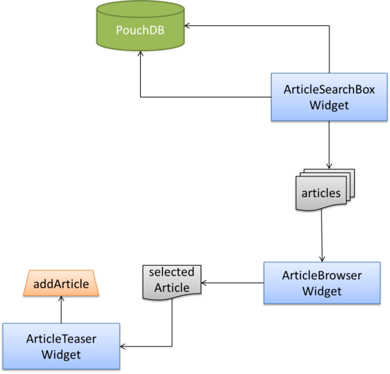

# ArticleTeaserWidget
The ArticleTeaserWidget has two tasks:
Display the details of a selected article and let the user add this article to the shopping cart.
In the last chapter we implemented the ArticleBrowserWidget which publishes a selected article as a resource on the EventBus, which is exactly the information the ArticleTeaserWidget will use to carry out its tasks.
It then displays the details of the article published as selected and provides an *add to cart* button for it.
Whenever the user presses the button the widget publishes a `takeActionRequest` event for the ShoppingCartWidget to add the selected article to the cart or increase the amount if it was already added.

## Integration in the Application
  

## Appearance
  

## Create the Base Files
Like we did for the ArticleBrowserWidget we execute `grunt-init` with the `laxar-widget` template to create a stub for the widget and accelerate the development process.
If still running we stop the server (`Ctrl-C`).

```shell
mkdir -p includes/widgets/shop_demo/article_teaser_widget
cd includes/widgets/shop_demo/article_teaser_widget
grunt-init laxar-widget
```

We start the server with `npm start` again.
```shell
cd -
npm start
```

## Display Article
The first requirement is that it is possible to configure a resource resembling an article.
We assume that this resource will be published by another widget or activity on the EventBus and that it will have information about an article.
In our ShopDemo app it will be the article selected by the user.

The implementation of this feature doesn't differ much from the **display** feature of the ArticleBrowserWidget.
[shop_demo/includes/widgets/shop_demo/article_teaser_widget/spec/article_teaser_widget_spec.js:](../../includes/widgets/shop_demo/article_teaser_widget/spec/article_teaser_widget_spec.js)

We need some dummy data for the test and create a file like we did for the ArticleBrowserWidget:
[shop_demo/includes/widgets/shop_demo/article_teaser_widget/spec/spec_data.json](../../includes/widgets/shop_demo/article_teaser_widget/spec/spec_data.json)

Next we add the feature `display` to the widget.json:
[shop_demo/includes/widgets/shop_demo/article_teaser_widget/widget.json:](../../includes/widgets/shop_demo/article_teaser_widget/widget.json)

For this feature we already adjust the template by adding the headline and a definition list for the article details:
[shop_demo/includes/widgets/shop_demo/article_teaser_widget/default.theme/article_teaser_widget.html](../../includes/widgets/shop_demo/article_teaser_widget/default.theme/article_teaser_widget.html)

Again we use the resource handler defined in the LaxarJS Patterns library to listen for the relevant events of the resource:
[shop_demo/includes/widgets/shop_demo/article_teaser_widget/article_teaser_widget.js](../../includes/widgets/shop_demo/article_teaser_widget/article_teaser_widget.js#L24)  

If you don't want to style the widget yourself, you can simply copy the existing stylesheets from here: [shop_demo/includes/widgets/shop_demo/article_teaser_widget/default.theme/css/article_teaser_widget.css](../../includes/widgets/shop_demo/article_teaser_widget/default.theme/css/article_teaser_widget.css).
The sass files the css was generated from can be found [here](../../includes/widgets/shop_demo/article_teaser_widget/default.theme/scss/article_teaser_widget.scss).

## Add an Article to the Cart
The second requirement is that the user can add the displayed article to the shopping cart.
For this feature we add a button which triggers a `takeActionRequest` event on the EventBus to broadcast our intention.
As the implementation of the cart is not part of this widget, the actual addition of the article to the items in the cart is also out of scope.
The name of the action is configured in the `button` feature, where also the labeling of the button takes place.
[shop_demo/includes/widgets/shop_demo/article_teaser_widget/widget.json](../../includes/widgets/shop_demo/article_teaser_widget/widget.json#L58)

### Test
We need to test if the widget triggers the `takeActionRequest.<action>` when the user presses the button.

[shop_demo/includes/widgets/shop_demo/article_teaser_widget/spec/article_teaser_widget_spec.js:](../../includes/widgets/shop_demo/article_teaser_widget/spec/article_teaser_widget_spec.js#L106)
```javascript
describe( 'with feature button and user adds an article to cart', function() {

   beforeEach( function() {
      setup( configuration );
      testBed.eventBusMock.publish( 'didReplace.article', {
         resource: 'article',
         data: resourceData
      } );
      jasmine.Clock.tick( 0 );
      $( 'button' ).trigger( 'click' );
   } );

   it( 'publishes a takeActionRequest to add the selected article to cart', function() {
      expect( testBed.scope.eventBus.publish )
         .toHaveBeenCalledWith( 'takeActionRequest.addArticle', {
            action: 'addArticle'
         }
      );
   } );
} );
```

Add the property `button` to the configuration in line 21.
```javascript
var configuration = {
   display: {
      resource: 'article'
   },
   button: {
      htmlLabel: 'Add to Cart',
      action: 'addArticle'
   }
};
```

### Implement the Feature
To implement the feature **button** we add the function `$scope.addToCart` in the controller, that is responsible for triggering the configured `takeActionRequest` event.
We then add a simple button to the HTML template, that triggers this function on click by using the according `ngClick` directive from AngularJS.

[shop_demo/includes/widgets/shop_demo/article_teaser_widget/article_teaser_widget.js](../../includes/widgets/shop_demo/article_teaser_widget/article_teaser_widget.js#L26)  

```javascript
$scope.addToCart = function() {
   var actionName = $scope.features.button.action;
   $scope.eventBus.publish( 'takeActionRequest.' + actionName, {
      action: actionName
   } );
};
```

[shop_demo/includes/widgets/shop_demo/article_teaser_widget/default.theme/article_teaser_widget.html](../../includes/widgets/shop_demo/article_teaser_widget/default.theme/article_teaser_widget.html#L25)

## Add the Widget to Application
We add the widget to the `content1b` area of our first page and configure only the required features that have no sufficient default value defined in the `widget.json`.

`shop_demo/application/pages/shop_demo.json:`
```json
"content1b": [
   {
      "widget": "shop_demo/article_teaser_widget",
      "features": {
         "display": {
            "resource": "selectedArticle"
         },
         "button": {
            "htmlLabel": "<i class='fa fa-shopping-cart'></i> Add to Cart",
            "action": "addArticle"
         }
      }
   }
]
```

Stop the server and start it again with `npm start`.

## Next Step
Our app has an *add to cart* button in the article details section now.
When pressing it nothing visible happens as the [ShoppingCartWidget](shopping_cart_widget.md) is still missing.
Let's implement that one next.


[<< ArticleBrowserWidget](article_browser_widget.md) | ArticleTeaserWidget | [ShoppingCartWidget >>](shopping_cart_widget.md)

