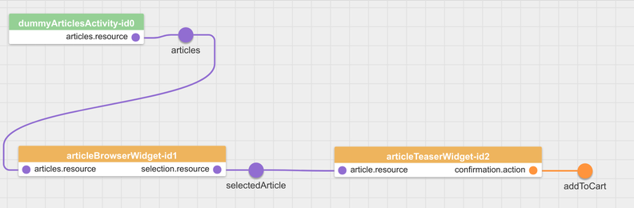

# Final Steps
We add the OrderActivity and the HeadlineWidget to the application and edit the second page.

## OrderActivity
The OrderActivity listens to the order action request of the ShoppingCartWidget. When receiving it, the activity publishes the mandatory ```willTakeAction``` event and sends the order to the PouchDB back end. If the operation is successful it publishes a ```didTakeAction``` with the outcome ```SUCCESS``` and in other case with outcome ```ERROR```.





If the order is successfully placed our application should navigate to the second page finish_order.json. To navigate to another page a widget or an activity has to publish the ```navigateRequest``` event. In the OrderActivity we let it publish the event with the target place we configured in the page and the flow.

[shop_demo/includes/widgets/shop_demo/order_activity/order_activity.js:](../../includes/widgets/shop_demo/order_activity/order_activity.js#L42)
```javascript
$scope.eventBus.publish( 'navigateRequest.' + features.order.target, {
   target : features.order.target,
   data: {}
} );
```

The application/flow.json:
```javascript
{
   "places": {
```
```
     "finishOrder": {
         "page":  "finish_order"
      }
   }
}
```

And the page where we configure the target.
[shop_demo/application/pages/shop_demo.json:](../../application/pages/shop_demo.json#L5)
```json
"activities": [
         {
            "widget": "shop_demo/order_activity",
            "features": {
               "cart": {
                  "resource": "cart"
               },
               "order":{
                  "action": "order",
                  "target": "finishOrder"
               },
               "database":{
                  "pouchDb": {
                     "dbId": "orders"
                  }
               }
            }
         }
      ],
```

## Second Page
The second page is a simple one with a HeadLineWidget. Get the widget and create the page.

[shop_demo/application/pages/finish_order.json](../../application/pages/finish_order.json)

[shop_demo/includes/widgets/shop_demo/headline_widget](../../includes/widgets/shop_demo/headline_widget)

Now we start the server with ```npm start``` again and visit it at [http://localhost:8000/debug.html](http://localhost:8000/debug.html). When placing a order we navigate to a second page.

## Finish
The application is completed now and we compile a optimized version:
```
grunt dist
```

Start the server with ```npm start``` and visit the [http://localhost:8000/index.html](http://localhost:8000/index.html).

## Next Step
Develop your own application!

[<< ShoppingCartWidget](shopping_cart_widget.md)  | Final steps  
