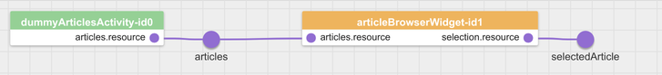

# ShoppingCartWidget
Our next step for our ShoppingCart app is to implement the ShoppingCartWidget. It will display the cart with all added articles and let the user change the quantity of them. The widget publishes the cart (list of orders) as a resource and triggers an action when the user demands an order.  

## Integration in the Application
  

## Appearance
  

## Create the Base Files
Create the widget using `grunt-init` with the `laxar-widget` template:
```shell
mkdir -p includes/widgets/shop_demo/shopping_cart_widget
cd includes/widgets/shop_demo/shopping_cart_widget
grunt-init laxar-widget
```

## Features of the ShoppingCartWidget
This widget will have the features **article**, **display** and **cart**.

In detail the widget has three things to do:

First it has to subscribe to changes of the selected article and the `takeActionRequest` event, that expresses the intent of the user to add the article to the cart.

Next the widget has to manage the cart with the list of all added articles and has to display them.
The user has to be able to change the quantity and delete articles from the shopping cart completely.

Finally every change of the cart must be published as a resource on the EventBus to provide a current representation of the shopping cart contents to other widgets.
The responsibility of this widget is management of the shopping cart contents but not the process of ordering the items itself.
We'll see that missing piece later in the last part of this tutorial.

### Feature  *display*
The widget has to display the shopping cart.
The necessary labels with their defaults are defined in the `widget.json`, but it's possible to configure own labels when adding the widget to the page.
If the shopping cart is empty the widget will display the string configured under the path `features.display.htmlNoItemsText` as a hint.

### Feature *article*
This feature is the glue that consolidates the selection of an article in the ArticleBrowserWidget with the `takeActionRequest` event send as instruction to add the article to the cart.
Hence it's possible to configure the name of the resource resembling the article selection and one or more actions that trigger the addition of that article to the cart.

### Feature *cart*
This feature is used to configure the name of the resource the articles in the shopping cart are published as via `didReplace` event.
Additionally the button used to publish a `takeActionRequest` to actually request the ordering of the articles is configured here

### Tests
In the tests of this widgets we will see a new way of testing the expected outcome of a series of `didReplace` and `didUpdate` events.
Instead of inspecting each event in an isolated way, we simulate a collaborating widget, that consumes these resource events via the LaxarJS patterns resource handler as a slave and test whether the current model meets our expectations.
To achieve this we add the variable `specScope`, which has all properties that are required by a resource handler to work properly.

[shop_demo/includes/widgets/shop_demo/shopping_cart_widget/spec/shopping_cart_widget_spec.js:](../../includes/widgets/shop_demo/shopping_cart_widget/spec/shopping_cart_widget_spec.js#L44)
```javascript
specScope = {
   eventBus: testBed.eventBusMock,
   features: features,
   resources: {}
};

// and later in line 101:
patterns.resources.handlerFor( specScope ).registerResourceFromFeature( 'cart' );
```

The spec test has three describe blocks.
The first part tests if the widget acts as master for the cart resource and publishes it for the first time after the `beginLifecycleRequest` event.
The second describe block tests the effects of several changes of the shopping cart contents.
On the one hand articles can be added through the selected article and the action request and increase their quantity and on the other hand the quantity of an added article can increased or decreased through user interaction directly with the ShoppingCartWidget DOM elements.
In the last part we test publishing our intent to dispatch the order via the `takeActionRequest` event.
When as a reply the `didTakeAction` event is received with the status `SUCCESS` the contents of the cart were ordered successfully and the cart can be cleared.


### Implementation

The features definition in the `widget.json` of the ShoppingCartWidget is similar to the definition of the other widgets.

[shop_demo/includes/widgets/shop_demo/shopping_cart_widget/widget.json:](../../includes/widgets/shop_demo/shopping_cart_widget/widget.json)


In the controller we add two handlers for the cart resource.
One for receiving updates and one to publish updates.

[shop_demo/includes/widgets/shop_demo/shopping_cart_widget/shopping_cart_widget.js:](../../includes/widgets/shop_demo/shopping_cart_widget/shopping_cart_widget.js#L35)
```javascript
var updatePublisherForCart = patterns.resources.updatePublisherForFeature( $scope, 'cart' );
var updateHandlerForCart = patterns.resources.updateHandler( $scope, 'cart' );

$scope.eventBus.subscribe( 'didUpdate.cart', updateHandlerForCart );
```

[shop_demo/includes/widgets/shop_demo/shopping_cart_widget/shopping_cart_widget.js:](../../includes/widgets/shop_demo/shopping_cart_widget/shopping_cart_widget.js#L64)
```javascript
updatePublisherForCart.compareAndPublish( oldCart, resources.cart );
```

The object `oldCart` is a clone of the resource before it will change. For the creation we use the function `deepClone` of laxar.
[shop_demo/includes/widgets/shop_demo/shopping_cart_widget/shopping_cart_widget.js:](../../includes/widgets/shop_demo/shopping_cart_widget/shopping_cart_widget.js#L61)
```javascript
var oldCart = ax.object.deepClone( resources.cart );
```

The function `compareAndPublish` creates patches in [JSON Patch](http://tools.ietf.org/html/rfc6902) format and publishes them as `didUpdate` event on the EventBus.

To replace the resource or for the initial publishing we create the function `replaceCart`.
It invokes the function `$scope.eventBus.publish`.
It expects the event name, the event object and additional options.
The event name consists of the event type (`didReplace`), a dot as separator and the resource name.
The event object has two properties the configured name of the resource (`$scope.features.cart.resource`) and the cart as data (`$scope.resources.cart`).
The option `deliverToSender: false` implies that the EventBus doesn't deliver the event back to the ShoppingCartWidget.

[shop_demo/includes/widgets/shop_demo/shopping_cart_widget/shopping_cart_widget.js:](../../includes/widgets/shop_demo/shopping_cart_widget/shopping_cart_widget.js#L135)
```javascript
function replaceCart() {
   $scope.eventBus.publish( 'didReplace.' + features.cart.resource, {
         resource: features.cart.resource,
         data: resources.cart
      }, {
         deliverToSender: false
      }
   );
}
```

When the widget receives a `takeActionRequest` event for one of the configured `features.article.onActions` actions it invokes the function `addArticleToCart`.
[shop_demo/includes/widgets/shop_demo/shopping_cart_widget/shopping_cart_widget.js:](../../includes/widgets/shop_demo/shopping_cart_widget/shopping_cart_widget.js#L42)
```javascript
$scope.features.article.onActions.forEach( function( action ) {
   $scope.eventBus.subscribe( 'takeActionRequest.' + action, addArticleToCart );
} );
```

The function `addArticleToCart` publishes a `willTakeAction`,
[shop_demo/includes/widgets/shop_demo/shopping_cart_widget/shopping_cart_widget.js:](../../includes/widgets/shop_demo/shopping_cart_widget/shopping_cart_widget.js#L99)
```javascript
function addArticleToCart( event ) {
   $scope.eventBus.publish( 'willTakeAction.' + event.action, event );
```
adds the article to cart and publishes an update for the resource.

And finally publishes a `didTakeAction`:
[shop_demo/includes/widgets/shop_demo/shopping_cart_widget/shopping_cart_widget.js:](../../includes/widgets/shop_demo/shopping_cart_widget/shopping_cart_widget.js#L119)
```javascript
$scope.eventBus.publish( 'didTakeAction.' + event.action, event );
```

The HTML template doesn't have LaxarJS specific code beyond the fact there are variables used which are defined in the widget.json.  
[shop_demo/includes/widgets/shop_demo/shopping_cart_widget/default.theme/shopping_cart_widget.html](../../includes/widgets/shop_demo/shopping_cart_widget/default.theme/shopping_cart_widget.html)


## Add the Widget to Application
We add the widget to the `content1c` section of our first page.
We configure only the required features.

**shop_demo/application/pages/shop_demo.json:**
```json
"content1c": [
   {
      "widget": "shop_demo/shopping_cart_widget",
      "features": {
         "cart": {
            "resource": "cart",
            "order": {
               "action": "order",
               "button": {
                  "htmlLabel": "<i class='fa fa-send'></i> Order"
               }
            }
         },
         "article": {
            "resource": "selectedArticle",
            "onActions": [ "addArticle" ]
         }
      }
   }
],
```

Stop the server and start it with `npm start` again.

## Next Step
The user can select articles, can have a look at the details and can add them to cart.
But when he wants to order the cart nothing happens.
The ShoppingCartWidget triggers the action `addArticle` but no other widget or activity reacts.
For this purpose we do some [final steps](final_steps.md) like implement the OrderActivity and add a second page.
 

[<< ArticleTeaserWidget](article_teaser_widget.md)  | ShoppingCartWidget | [Final steps >>](final_steps.md)  
