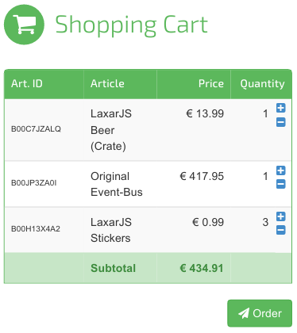

# ShoppingCartWidget
Our next step for our ShoppingCart app is to implement the ShoppingCartWidget. It will display the cart with all added articles and let the user change the quantity of them. The widget publishes the cart (list of orders) as a resource and triggers an action when the user demands an order.  

## Integration in the Application
  

## Appearance
  

## Create the Base Files
Create the widget with the```laxar-widget``` script:
```sh
mkdir -p includes/widgets/shop_demo/shopping_cart_widget
cd includes/widgets/shop_demo/shopping_cart_widget
grunt-init laxar-widget
```

## Features of the ShoppingCartWidget
Our widget has the features: **article**, **display** and **cart**.  

In detail the widget has three things to do. First it has to listen to several events on the EventBus. The widget has to recognize whether an article is selected and the details about it are published as a resource on the EventBus or if the user wants to add the selected article to cart and the configured action is triggered by an other widget.   

Secondly the widget has to manage the cart with the list of all added articles and has to display them. The user has to be able to change the quantity and delete articles from cart.  

Thirdly every change of the cart must be published as a resource to the EventBus. So that other widgets have the possibility to deal with the cart. In one of the next tutorials we will implement the OrderActivity which will listen to this shopping cart resource. It sends the list to a back end when a configured action is triggered which will be the case when the user wants to order the items and presses the appropriate button.

### Feature  *display*
The widget has to display the shopping cart. The necessary labels with their defaults are defined in the widget.json. When embed the widget to a page it is possible to configure own labels. If the shopping cart is empty the widget displays the configurable string ```features.display.htmlNoItemsText``` as a hint.

### Feature *article*
Before the widget can display the cart it needs some items in it. In the last steps we implemented the ArticleBrowserWidget which lists some articles and lets the user select one. And we created the ArticleTeaserWidget which displays the selected article and lets the user to trigger an action for adding the article to cart.
 
1. The ArticleBrowserWidget lists some articles and the user selects one.
2. The ArticleBrowserWidget publishes the selected article as a resource under the designation which is configured in the page  **shop_demo.json**.
3. The ArticleTeaserWidget displays the selected article.
4. The user presses the *add to cart* button.
5. The ArticleTeaserWidget publishes the ```takeActionRequest``` event of the configured action for adding an item to cart.

Our ShoppingCartWidget has to listen to both events. We already implemented in the ArticleTeaserWidget how a widet listens to the selected article. In addition we have to test and implement the reaction to the ```takeActionRequest``` and how the widget masters the cart resource. When the ShoppingCartWidget receives a ```takeActionRequest``` it publishes a ```willTakeAction```, adds the selected article to cart and publishes an update of the cart resource and finally publishes a ```didTakeAction```.

### Feature *cart*
The ShoppingCartWidget is the master of the cart resource. It is the only widget that is allowed to publish a ```didReplace``` event for this resource. But it reflects updates for it and publishes updates too.  
The other property for this feature is the order of the cart. The widget has a button for sending an order request to the OrderActivity.


### Tests
In the tests we have the variable ```specScope```. It simulates a widget which acts as slave for the cart resource. We can use the object ```specScope``` to proof if the ShoppingCartWidget published the cart resource in the different cases we expect.

[shop_demo/includes/widgets/shop_demo/shopping_cart_widget/spec/shopping_cart_widget_spec.js:](../../includes/widgets/shop_demo/shopping_cart_widget/spec/shopping_cart_widget_spec.js#L44)
```javascript
specScope = {
   eventBus: testBed.eventBusMock,
   features: features,
   resources: {}
};
```
We use LaxarJS Patterns to create a handler for the cart resource.

[shop_demo/includes/widgets/shop_demo/shopping_cart_widget/spec/shopping_cart_widget_spec.js:](../../includes/widgets/shop_demo/shopping_cart_widget/spec/shopping_cart_widget_spec.js#L101)
```javascript
patterns.resources.handlerFor( specScope ).registerResourceFromFeature( 'cart' );
```

The spec test has three describe blocks. The first part tests if the widget acts as master for the cart resource and publishes the resource after the ```beginLifecycleRequest```.  
The second describe block has many tests about the changes of the cart. On the one hand articles can be add trough the selected article and the action request and increase their quantity and on the other hand the quantity of an added article can increased or decreased through user interaction directly with the ShoppingCartWidget DOM elements.  
With the last part we tests the possibility of order the cart. The widget has to send a ```takeActionRequest``` for the order action. When the ```didTakeAction``` event is received with the status ```SUCCESS``` then the cart was ordered successfully and the cart can be cleared.


### Implementation

The features definition in the widget.json of the ShoppingCartWidget is similar to the definition of the other widgets.

[shop_demo/includes/widgets/shop_demo/shopping_cart_widget/widget.json:](../../includes/widgets/shop_demo/shopping_cart_widget/widget.json)


In the controller we add two handler for the cart resource. One for receiving updates and one to publish updates.

[shop_demo/includes/widgets/shop_demo/shopping_cart_widget/shopping_cart_widget.js:](../../includes/widgets/shop_demo/shopping_cart_widget/shopping_cart_widget.js#L35)
**shop_demo/includes/widgets/shop_demo/shopping_cart_widget/shopping_cart_widget.js:**
```javascript
var updatePublisherForCart = patterns.resources.updatePublisherForFeature( $scope, 'cart' );
var updateHandlerForCart = patterns.resources.updateHandler( $scope, 'cart' );

$scope.eventBus.subscribe( 'didUpdate.cart', updateHandlerForCart );
```

[shop_demo/includes/widgets/shop_demo/shopping_cart_widget/shopping_cart_widget.js:](../../includes/widgets/shop_demo/shopping_cart_widget/shopping_cart_widget.js#L64)
```javascript
updatePublisherForCart.compareAndPublish( oldCart, resources.cart );
```

The object ```oldCart``` is a clone of the resource before it will change. For the creation we use the function ```deepClone``` of laxar.
[shop_demo/includes/widgets/shop_demo/shopping_cart_widget/shopping_cart_widget.js:](../../includes/widgets/shop_demo/shopping_cart_widget/shopping_cart_widget.js#L61)
```javascript
var oldCart = ax.object.deepClone( resources.cart );
```


The function ```compareAndPublish``` creates an update with JSON Patch and publishes it for the resource on the EventBus.
  
  
To replace the resource or for the initial publishing we create the function ```replaceCart```. It invokes the function ```$scope.eventBus.publish```. It expects the event name, the event object and additional options. The event name consists of the event type (```didReplace```), a dot as separator and the resource name. The event object has two properties the configured name of the resource (```$scope.features.cart.resource```) and the cart as data (```$scope.resources.cart```). The option ```deliverToSender: false``` implies that the EventBus doesn't deliver the event back to the ShoppingCartWidget.

[shop_demo/includes/widgets/shop_demo/shopping_cart_widget/shopping_cart_widget.js:](../../includes/widgets/shop_demo/shopping_cart_widget/shopping_cart_widget.js#L135)
```javascript
function replaceCart() {
   $scope.eventBus.publish( 'didReplace.' + features.cart.resource, {
         resource: features.cart.resource,
         data: resources.cart
      }, {
         deliverToSender: false
      }
   );
}
```

When the widget receives a ```takeActionRequest``` event for one of the configured ```features.article.onActions``` actions it invokes the function ```addArticleToCart```.
[shop_demo/includes/widgets/shop_demo/shopping_cart_widget/shopping_cart_widget.js:](../../includes/widgets/shop_demo/shopping_cart_widget/shopping_cart_widget.js#L42)
```javascript
$scope.features.article.onActions.forEach( function( action ) {
   $scope.eventBus.subscribe( 'takeActionRequest.' + action, addArticleToCart );
} );
```

The function ```addArticleToCart``` publishes a ```willTakeAction```,
[shop_demo/includes/widgets/shop_demo/shopping_cart_widget/shopping_cart_widget.js:](../../includes/widgets/shop_demo/shopping_cart_widget/shopping_cart_widget.js#L99)
```javascript
function addArticleToCart( event ) {
   $scope.eventBus.publish( 'willTakeAction.' + event.action, event );
```
adds the article to cart and publishes an update for the resource.

And finally publishes a ```didTakeAction```:
[shop_demo/includes/widgets/shop_demo/shopping_cart_widget/shopping_cart_widget.js:](../../includes/widgets/shop_demo/shopping_cart_widget/shopping_cart_widget.js#L119)
```javascript
$scope.eventBus.publish( 'didTakeAction.' + event.action, event );
```


The HTML template doesn't have LaxarJS specific code beyond the fact there are variables used which are defined in the widget.json.  
[shop_demo/includes/widgets/shop_demo/shopping_cart_widget/default.theme/shopping_cart_widget.html](../../includes/widgets/shop_demo/shopping_cart_widget/default.theme/shopping_cart_widget.html)


## Add the Widget to Application
We add the widget to the ```content1c``` section of our first page. We configure only the required features.

**shop_demo/application/pages/shop_demo.json:**
```json
"content1c": [
   {
      "widget": "shop_demo/shopping_cart_widget",
      "features": {
         "cart": {
            "resource": "cart",
            "order": {
               "action": "order",
               "button": {
                  "htmlLabel": "<i class='fa fa-send'></i> Order"
               }
            }
         },
         "article": {
            "resource": "selectedArticle",
            "onActions": [ "addArticle" ]
         }
      }
   }
],
```

Stop the server and start it with ``` npm start ``` again.

## Next Step
The user can select articles, can have a look at the details and can add them to cart. But when he wants to order the cart nothing happens. The ShoppingCartWidget triggers the action ```addArticle``` but no other widget or activity reacts. For this purpose we do some [final steps](final_steps.md) like implement the OrderActivity and add a second page.  
 

[<< ArticleTeaserWidget](article_teaser_widget.md)  | ShoppingCartWidget | [Final steps >>](final_steps.md)  
